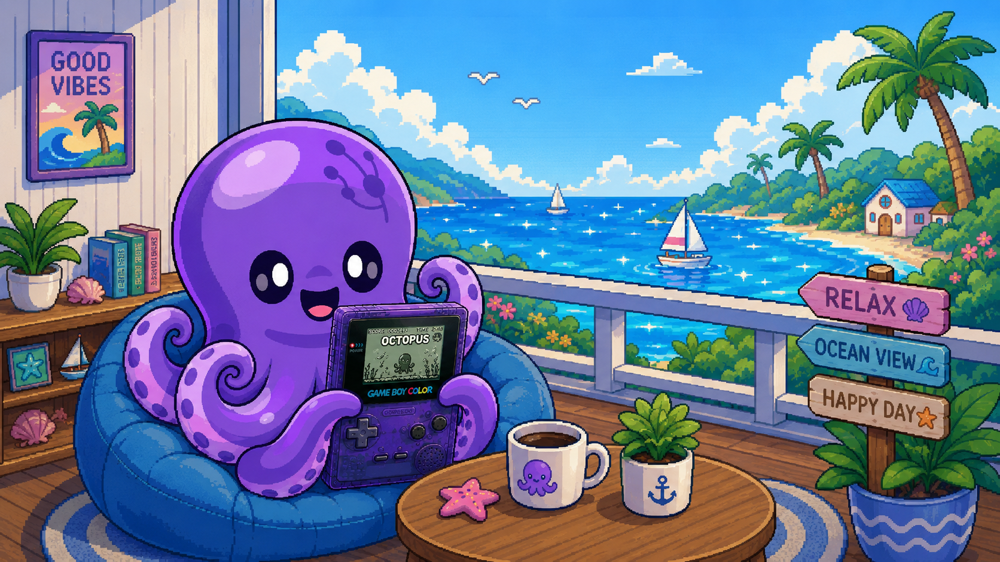

# RuxBoy

[English](README.md) | **日本語**

<p align="center">
  
</p>


Game Boy Color エミュレーター。[Rux 言語](https://rux-lang.dev/) で書かれ、マルチメディア層に SDL3 を使うコマンドラインアプリです。

コアは BubiBoy Lite (Odin + SDL2, MIT License) を Rux へ移植したものです。

まだパフォーマンスに難があります。Apple M4相当のパワーがあればまともに動作すると思います。

<p align="center">
  <a href="https://github.com/bubio/ruxboy/releases/latest">
    
  </a>
  <a href="https://github.com/bubio/ruxboy/blob/main/LICENSE">
    
  </a>
  <a href="https://github.com/bubio/ruxboy/actions/workflows/ci.yml">
    
  </a>
  <a href="https://github.com/bubio/ruxboy/releases/latest">
    
  </a>
</p>


## 対応プラットフォーム

- macOS 13.5+ (Intel / Apple Silicon)
- Ubuntu 26.04+ (amd64 / arm64)
- Windows 11+ (x64)

## インストール

[Releases](../../releases) から対応する zip をダウンロードして展開してください。

- **macOS / Linux**: 実行には SDL3 のランタイムが別途必要です。
  macOS は `brew install sdl3`、Ubuntu 26.04+ は `sudo apt-get install libsdl3-0`
  で導入できます(開発用の `-dev` パッケージは不要です)。
- **Windows**: zip に `SDL3.dll` が同梱されているため追加の準備は不要です。
  `RuxBoy.exe` と同じフォルダに置いたまま実行してください。
- **macOS**: 未署名バイナリのため、初回実行時に Gatekeeper が開発元を確認できない
  旨の警告を出すことがあります。その場合は `xattr -d com.apple.quarantine
  ./RuxBoy` を実行するか、Finder でバイナリを右クリックして **開く** を選んで
  ください。

## ビルド

コンパイラと標準ライブラリは submodule (`external/Rux`) から取得します。

```sh
git clone --recurse-submodules <このリポジトリのURL>
cd RuxBoy
```

### macOS

```sh
brew install llvm@22 cmake ninja sdl3
(cd external/Rux && sh Run.sh build --compiler "$(brew --prefix llvm@22)/bin/clang++")
sh scripts/build_macos.sh --release
```

### Linux (Ubuntu 26.04+)

```sh
sudo apt-get install clang-22 cmake ninja-build libsdl3-dev
(cd external/Rux && sh Run.sh build --compiler /usr/bin/clang++-22)
sh scripts/build_linux.sh --release
```

### Windows

Visual Studio(Desktop development with C++)と LLVM 22 が必要です。ビルドは
Visual Studio の開発者環境(`vcvarsall.bat`)を読み込んだ同一シェルセッション内
で行ってください。

```powershell
# Developer PowerShell for VS 内で実行
cd external\Rux
.\Run.ps1 build -Compiler <LLVM 22 の clang++.exe へのパス>
cd ..\..
sh scripts/fetch_sdl3_windows.sh
sh scripts/build_windows.sh --release
```

ビルド成果物は `Packages/App/Bin/Release/<OS>/<Arch>/RuxBoy[.exe]` に生成されます。

## 使い方

```
使用法: RuxBoy [options] game.gbc

  -h, --help        コマンドラインの使い方を表示
  -v, --version     バージョンを表示
  --scale N         表示倍率 (1-8、9以上は8に丸める、デフォルト 4)
  --fullscreen      フルスクリーン表示 (--scale は無視される)
  --shader KIND     シェーダー: nearest, smooth (デフォルト nearest)
  --recent          最近使ったROMの一覧を表示して終了
```

### キーボードショートカット (ROM実行中)

| キー | 機能 |
|---|---|
| 矢印キー | 十字キー |
| Z / X | B / A |
| Enter | Start |
| 右Shift | Select |
| F1 | 現在のスロットへセーブステートを保存 |
| F3 | 現在のスロットからセーブステートを復元 |
| Esc | 終了 |

## ライセンス

[MIT License](LICENSE)
